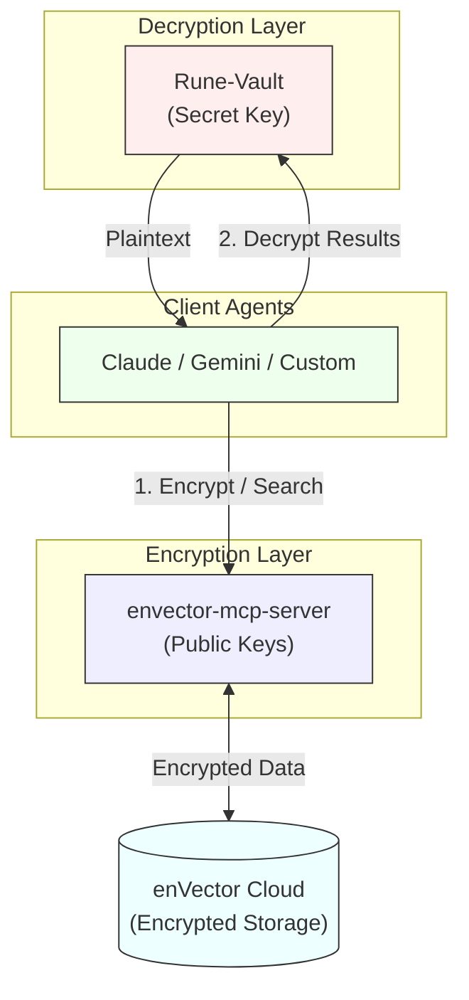

# Rune

**Organizational Memory System for Claude**

Rune is a `/plugin` installable system that provides FHE-encrypted organizational memory for Claude agents. Install with one command, configure with your team's credentials, and start capturing institutional knowledge.

## What is This?

This is the **complete plugin** with everything needed to run Rune locally:

**Includes**:
- ✅ MCP servers (Vault + enVector client)
- ✅ Python dependencies (pyenvector, fastmcp, etc.)
- ✅ Installation scripts (automated setup)
- ✅ Agent specifications (Scribe, Retriever)
- ✅ Claude skill prompts
- ✅ Configuration management

**Requires External Infrastructure** (deploy separately):
- ⚠️ Rune-Vault server (team-shared, deployed by admin)
- ⚠️ enVector Cloud account (sign up at [envector.io](https://envector.io))

**Architecture**:
```
Your Machine                    Cloud Infrastructure
━━━━━━━━━━━━━                  ━━━━━━━━━━━━━━━━━━━━━
Claude + Rune Plugin     →     Rune-Vault (team-shared)
  ├─ Vault MCP Server    →       ↓ (decryption)
  ├─ enVector MCP Server →     enVector Cloud (encrypted vectors)
  ├─ Scribe Agent                 ↑ (encryption)
  └─ Retriever Agent
```

**Data Flow**:
- **Capture**: Scribe → enVector MCP Server (encrypt) → enVector Cloud
- **Retrieve**: Query → enVector Cloud → Vault MCP Server (decrypt via Rune-Vault) → Claude

## Prerequisites

Before installing this plugin, you MUST have:

### 1. Rune-Vault Access (from your team admin)
- **Vault URL**: `https://vault-YOURTEAM.oci.envector.io`
- **Vault Token**: `evt_YOURTEAM_xxx`

### 2. enVector Cloud Credentials
- **Cluster Endpoint**: `https://cluster-xxx.envector.io`
- **API Key**: `envector_xxx`

**Don't have these?** Contact your team administrator or see the [full Rune deployment guide](https://github.com/CryptoLabInc/rune-admin).

## Installation

### Automated Installation (Recommended)

```
/plugin install github.com/CryptoLabInc/rune
```

**What happens**:
1. Plugin files downloaded
2. Python virtual environment created
3. Dependencies installed (pyenvector, fastmcp, etc.)
4. MCP servers configured in Claude
5. You're prompted to configure credentials

**Requirements**:
- Python 3.8+
- 500MB disk space
- Internet connection

### Manual Installation (Advanced)

```bash
# Clone repository
git clone https://github.com/CryptoLabInc/rune.git
cd rune

# Run installation script
./scripts/install.sh

# Configure Claude MCP servers
./scripts/configure-claude-mcp.sh

# Configure credentials
# (or use /rune configure in Claude)
cp config/config.template.json ~/.rune/config.json
nano ~/.rune/config.json
```

### Installation Verification

```bash
# Check infrastructure
cd rune
./scripts/check-infrastructure.sh
```

Expected output:
```
✓ Configuration file found
✓ Vault URL: https://vault-team.oci.envector.io
✓ Vault is accessible (HTTP 200)
✓ Vault MCP server is running (PID: 12345)
✓ Python virtual environment found
✓ Infrastructure checks passed ✓
```

## Configuration

### Initial Setup

After installation, you have two options:

**Option A: Interactive (Recommended)**
```
/rune configure
```

Plugin will:
1. Ask for Vault URL, Token
2. Ask for enVector endpoint, API key
3. Validate infrastructure availability
4. Set state to Active (if infrastructure ready) or Dormant (if not)

**Option B: Manual**
```bash
cp config/config.template.json ~/.rune/config.json
nano ~/.rune/config.json
# Edit with your credentials
```

Then activate:
```
/rune activate
```

### Starting MCP Servers

After configuration, start the local MCP servers:

```bash
cd rune
./scripts/start-mcp-servers.sh
```

This starts:
- **Vault MCP server**: Connects to Rune-Vault for decryption
- **enVector MCP server**: Connects to enVector Cloud for encryption/storage

Logs: `~/.rune/logs/vault-mcp.log`

### Configuration File

Manually edit `~/.rune/config.json` if needed:

```json
{
  "vault": {
    "url": "https://vault-YOURTEAM.oci.envector.io",
    "token": "evt_YOURTEAM_xxx"
  },
  "envector": {
    "endpoint": "https://cluster-xxx.envector.io",
    "api_key": "envector_xxx",
    "collection": "YOURTEAM-context"
  },
  "state": "active"
}
```

## Plugin States

The plugin has two states based on configuration AND infrastructure availability:

### Active State ✅
**Requirements**:
- ✓ Configuration file with all credentials
- ✓ Infrastructure accessible (Vault + enVector)
- ✓ MCP servers running

**Behavior**:
- Automatically captures significant organizational context
- Retrieves encrypted memory on demand
- Full functionality enabled
- **Fail-safe**: Switches to Dormant if operations fail

### Dormant State ⏸️
**Triggers**:
- Configuration missing or incomplete
- Infrastructure not accessible
- MCP servers not running
- Automatic fail-safe from Active state

**Behavior**:
- **No token waste**: Does NOT attempt capture/retrieval
- **No network requests**: Only shows setup instructions
- Shows helpful diagnostics on `/rune status`
- Ready to activate when infrastructure is available

### State Transitions

```
Install → Dormant (default)
  ↓ /rune configure (with validation)
  ├─ Infrastructure ready → Active ✅
  └─ Infrastructure not ready → Dormant ⏸️

Dormant → Active
  ↓ /rune activate (after infrastructure is deployed)
  └─ Validation passes → Active ✅

Active → Dormant (automatic fail-safe)
  ↓ Operation fails (Vault unreachable, etc.)
  └─ Auto-switch to Dormant ⏸️
```

## Commands

### `/rune status`
Check plugin state and infrastructure health
```
Rune Plugin Status
==================
State: Active ✅

Configuration:
  ✓ Config file: ~/.rune/config.json
  ✓ Vault URL: https://vault-team.oci.envector.io

Infrastructure:
  ✓ Python venv: /path/to/.venv
  ✓ MCP servers: Running
```

### `/rune configure`
Interactive credential setup with validation

### `/rune activate` (or `/rune wakeup`)
Validate infrastructure and switch to Active state
```
# Use after infrastructure is deployed
/rune activate
```

### `/rune remember <context>`
Manually store organizational context (Active state only)
```
/rune remember "We chose PostgreSQL for better JSON support"
```

### `/rune recall <query>`
Search organizational memory (Active state only)
```
/rune recall "Why PostgreSQL?"
```

### `/rune reset`
Clear configuration and return to Dormant state

## Usage

Once activated, the plugin works automatically:

### Automatic Context Capture
Claude will automatically capture significant decisions and context:
- Architecture decisions
- Technical rationale
- Code patterns
- Team agreements

### Manual Context Storage
```
/rune remember "We chose PostgreSQL for better JSON support"
```

### Context Retrieval
```
/rune recall "Why did we choose PostgreSQL?"
```

Or just ask Claude naturally:
```
"What database decisions did we make?"
```

## Security

- 🔐 **Zero-knowledge**: All data stored encrypted (FHE)
- 🔑 **Local credentials**: Tokens stored only in `~/.rune/config.json`
- 🛡️ **No cloud access**: enVector Cloud never sees plaintext
- 👥 **Team sharing**: Same Vault = shared organizational memory

## Troubleshooting

### Plugin installed but not working?

Check plugin state:
```
/rune status
```

### Missing credentials?

Reconfigure:
```
/rune configure
```

### Need to reset?

```bash
rm ~/.rune/config.json
/rune configure
```

## For Team Administrators

To deploy the full Rune infrastructure (Vault + MCP servers), see:
- **Rune-Admin Repository (for deployment)**: https://github.com/CryptoLabInc/rune-admin
- **Deployment Guide**: https://github.com/CryptoLabInc/rune-admin/blob/main/deployment/README.md

## Architecture



**Key Difference**: 
- **Rune-Vault** holds the **Secret Key** and only performs decryption of search results. It never sees the raw vectors during ingestion.
- **envector-mcp-server** uses **Public Keys** to encrypt data and perform searches. It can be scaled horizontally and doesn't hold the secret key.

## Related Projects

- **[Rune-Admin](https://github.com/CryptoLabInc/rune-admin)** - Infrastructure deployment and admin tools
- **[pyenvector](https://socket.dev/pypi/package/pyenvector)** - FHE encryption SDK
- **[enVector Cloud](https://envector.io)** - Encrypted vector database

## Support

- **Issues**: [GitHub Issues](https://github.com/CryptoLabInc/rune/issues)
- **Documentation**: [Full Rune Docs](https://github.com/CryptoLabInc/rune-admin/tree/main/docs)
- **Email**: zotanika@cryptolab.co.kr

## License

MIT License - See [LICENSE](LICENSE)

## Credits

Built by [CryptoLabInc](https://github.com/CryptoLabInc)

Part of the Rune organizational memory ecosystem.
