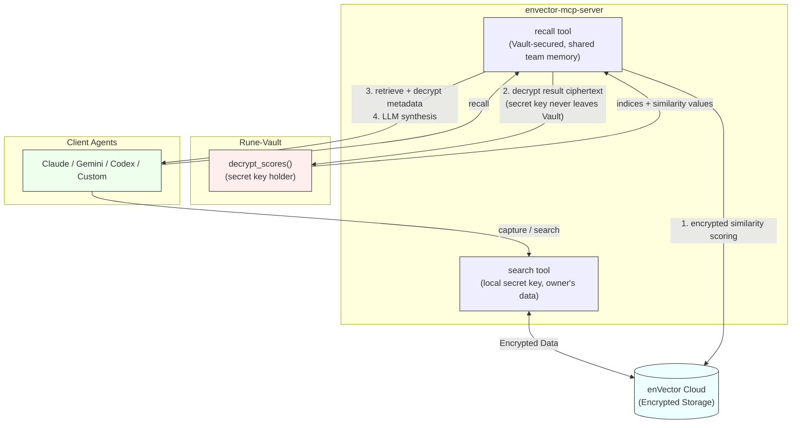

# Rune
**FHE-Encrypted Organizational Memory for AI Agents**

Rune is an agent-native plugin that transforms organizational memory into a strategic asset by **connecting the isolated activities of local agents through encrypted memory**.

Works with **Claude Code, Codex CLI, Gemini CLI**, and any MCP-compatible agent.

```bash
# Claude Code
/plugin install github.com/CryptoLabInc/rune

# Codex CLI
cd rune && ./scripts/install-codex.sh
```

## What is Rune?

This is the **complete plugin** with everything needed to run Rune locally:

- MCP server with FHE-encrypted vector operations (enVector + Vault integration)
- Multi-provider LLM support (Anthropic, OpenAI, Google) for capture filtering and recall synthesis
- Installation scripts for Claude Code, Codex CLI, and manual setup
- Agent specifications (Scribe for capture, Retriever for recall)

**Requires external infrastructure** (deploy separately):
- Rune-Vault server (team-shared, deployed by admin — see [rune-admin](https://github.com/CryptoLabInc/rune-admin))
- enVector Cloud account (sign up at [envector.io](https://envector.io))

## MCP Tools

Rune exposes these tools via MCP (stdio transport). Any MCP-compatible agent can use them directly.

| Tool | Description |
|------|-------------|
| **`capture`** | Capture organizational decisions via 3-tier pipeline (embedding similarity → LLM policy filter → LLM extraction → FHE-encrypted storage) |
| **`recall`** | Search and synthesize answers from encrypted team memory via Vault-secured pipeline (query expansion → encrypted scoring → Vault decryption → LLM synthesis) |
| **`vault_status`** | Check Rune-Vault connection status and security mode |
| **`reload_pipelines`** | Re-read config and reinitialize scribe/retriever pipelines |

**Example — capture a decision:**
```
capture(text="We chose PostgreSQL over MongoDB for better ACID guarantees and JSON support.")
```

**Example — recall past context:**
```
recall(query="Why did we choose PostgreSQL?", topk=5)
→ { answer: "The team chose PostgreSQL for...", sources: [...], confidence: 0.85 }
```

## Quick Start

### Claude Code
```
/plugin install github.com/CryptoLabInc/rune
```

### Codex CLI
```bash
git clone https://github.com/CryptoLabInc/rune.git
cd rune && ./scripts/install-codex.sh
```

### Gemini CLI / Other Agents
See [AGENT_INTEGRATION.md](AGENT_INTEGRATION.md) for Gemini CLI, OpenAI, and custom MCP client setup.

### After Installation
```bash
cp config/config.template.json ~/.rune/config.json
# Edit with your vault/envector credentials
```

Verify infrastructure:
```bash
cd rune && ./scripts/check-infrastructure.sh
```

## Architecture

```
Your Machine                    Cloud / Team Infrastructure
━━━━━━━━━━━━━                  ━━━━━━━━━━━━━━━━━━━━━━━━━━
AI Agent + Rune Plugin
  ├─ enVector MCP Server ──→   enVector Cloud (encrypted vectors)
  │    └─ recall tool    ──→   Rune-Vault (team-shared, secret key holder)
  ├─ Scribe (capture)               decrypts result ciphertext, returns top-k
  └─ Retriever (recall)

Supported Agents: Claude Code, Codex CLI, Gemini CLI, custom MCP clients
```



**Data Flow**:
- **Capture**: Scribe → MCP `capture` → 3-tier pipeline → FHE-encrypted insert → enVector Cloud
- **Recall**: MCP `recall` → query expansion → encrypted similarity scoring on enVector Cloud → Rune-Vault decrypts result ciphertext (secret key held exclusively by Vault) → retrieve and decrypt metadata → LLM synthesis
- **Own data search**: MCP `search` → encrypted similarity scoring → MCP server decrypts locally (secret key held by MCP server runtime)

**Key Design**:
- **Agent** calls MCP tools (`capture`, `recall`, `search`). Agent never contacts Vault directly.
- **`recall` tool** uses a Vault-secured pipeline. The secret key never leaves Vault. This isolation prevents agent tampering attacks from indiscriminately decrypting shared vectors.
- **Rune-Vault** holds the **secret key** exclusively. It decrypts only score ciphertext and metadata ciphertext — never sees raw vectors.
- **envector-mcp-server** uses **Public Keys** (EncKey, EvalKey) for encryption and search. It can be scaled horizontally.

## Prerequisites

Before installing, you need:

### 1. Rune-Vault Access (from your team admin)
- **Vault Endpoint**: Your Vault gRPC endpoint (e.g., `vault-host:50051`)
- **Vault Token**: Authentication token provided by your admin

### 2. enVector Cloud Credentials
- **Cluster Endpoint**: Your enVector endpoint (e.g., `runestone-xxx.clusters.envector.io`)
- **API Key**: Your enVector API key

**Don't have these?** Contact your team administrator or see the [full Rune deployment guide](https://github.com/CryptoLabInc/rune-admin).

## Configuration

### Configuration File

`~/.rune/config.json`:

```json
{
  "vault": {
    "endpoint": "your-vault-host:50051",
    "token": "your-vault-token"
  },
  "envector": {
    "endpoint": "runestone-xxx.clusters.envector.io",
    "api_key": "your-api-key"
  },
  "llm": {
    "provider": "anthropic",
    "tier2_provider": "anthropic"
  },
  "state": "active"
}
```

### LLM Provider

The `llm` section controls which LLM provider Scribe/Retriever use for filtering and synthesis.

| Provider | Value | Environment Variable |
|----------|-------|---------------------|
| Anthropic | `"anthropic"` | `ANTHROPIC_API_KEY` |
| OpenAI | `"openai"` | `OPENAI_API_KEY` |
| Google | `"google"` | `GOOGLE_API_KEY` or `GEMINI_API_KEY` |
| Auto-detect | `"auto"` | Inferred from MCP client identity |

See [config/README.md](config/README.md) for the full schema.

### Starting the MCP Server

```bash
cd rune && ./scripts/start-mcp-servers.sh
```

Logs: `~/.rune/logs/envector-mcp.log`

> Vault MCP runs on a remote server deployed by the team admin via [rune-admin](https://github.com/CryptoLabInc/rune-admin), not locally.

## Plugin States

| State | Behavior |
|-------|----------|
| **Active** | Full functionality — capture and recall enabled, fail-safe switches to Dormant on errors |
| **Dormant** | No network requests, no token waste — shows setup instructions, ready to activate |

Set `"state": "active"` in config after infrastructure is ready. The plugin automatically falls back to Dormant if operations fail.

## For Team Administrators

Rune requires a deployed **Rune-Vault** server and an **enVector Cloud** account. The Vault holds the team's secret key for decrypting search results — it is the single point of trust in the system.

### Deploying Infrastructure

See the [Rune-Admin Repository](https://github.com/CryptoLabInc/rune-admin):

1. **Deploy Rune-Vault** — OCI/AWS deployment via Terraform. Vault holds the secret key and enforces access policy (max results per query, audit trail).
2. **Create enVector Cloud account** — Sign up at [envector.io](https://envector.io), create a cluster, generate API keys.
3. **Provision team index** — Set the shared index name on the Vault server. All team members connecting to this Vault automatically use the same index.

### Onboarding Team Members

Provide each team member with:
1. Vault gRPC endpoint and authentication token (same for all members)
2. enVector cluster endpoint and API key (shared or individual)

Members install the plugin and enter these credentials in `~/.rune/config.json`. See [examples/team-setup-example.md](examples/team-setup-example.md) for a complete walkthrough.

### Security Management

- **Token rotation**: Generate new Vault token, distribute to current members, revoke old token.
- **Access revocation**: Rotate Vault token — departed members lose access immediately.
- **Multiple projects**: Deploy separate Vault instances per project for isolated memory spaces.

Full deployment guide: https://github.com/CryptoLabInc/rune-admin/blob/main/deployment/README.md

## Security & Privacy

**Zero-Knowledge Encryption**:
- All data is encrypted client-side using **Fully Homomorphic Encryption (FHE)** before leaving your machine.
- enVector Cloud performs similarity scoring on **encrypted data only** — the server never accesses plaintext.
- Rune-Vault decrypts only score and metadata **ciphertext** (not raw vectors) to select top-k results.

**Data Storage**:
- **Local**: Credentials in `~/.rune/config.json` (user-only access recommended: `chmod 600`).
- **Cloud**: Only FHE-encrypted vectors and encrypted metadata on enVector Cloud. No plaintext stored remotely.

**Third-Party Sharing**:
- Rune does **not** share data with third parties. In team deployments, Vault is operated by your team admin.

**Your Rights**:
- **Data deletion**: Remove encrypted vectors via enVector Cloud dashboard or MCP tools.
- **Configuration reset**: Delete `~/.rune/config.json` to remove all local credentials.
- **Full removal**: Uninstall the plugin and delete `~/.rune/`.

## Troubleshooting

### Plugin not working?

```bash
cd rune && ./scripts/check-infrastructure.sh
```

### Missing credentials?

```bash
cp config/config.template.json ~/.rune/config.json
# Edit with your credentials, set "state": "active"
```

### Need to reset?

```bash
rm ~/.rune/config.json
```

## Related Projects

- **[Rune-Admin](https://github.com/CryptoLabInc/rune-admin)** - Infrastructure deployment and admin tools
- **[pyenvector](https://socket.dev/pypi/package/pyenvector)** - FHE encryption SDK
- **[enVector Cloud](https://envector.io)** - Encrypted vector database

## Support

- **Issues**: [GitHub Issues](https://github.com/CryptoLabInc/rune/issues)
- **Documentation**: [Full Rune Docs](https://github.com/CryptoLabInc/rune-admin/tree/main/docs)
- **Email**: zotanika@cryptolab.co.kr

## License

Apache License 2.0 - See [LICENSE](LICENSE)

## Credits

Built by [CryptoLabInc](https://github.com/CryptoLabInc)

Part of the Rune organizational memory ecosystem.
