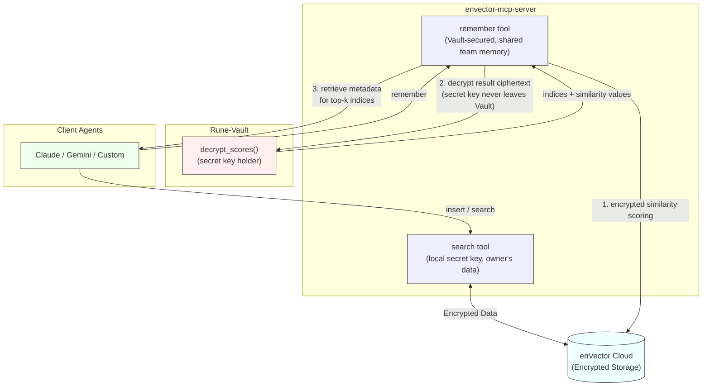

# Rune
**FHE-Encrypted Organizational Memory for AI Agents**

Rune is an agent-native plugin that transforms organizational memory into a strategic asset by **connecting the isolated activities of local agents through encrypted memory**.

Works with **Claude Code, Codex CLI, Gemini CLI**, and any MCP-compatible agent.

```bash
# Claude Code
/plugin install github.com/CryptoLabInc/rune

# Codex CLI
cd rune && ./scripts/install-codex.sh
```
Install with simple commands, configure with your team's credentials, and start capturing institutional knowledge.

## So, What is This?

This is the **complete plugin** with everything needed to run Rune locally:

**Includes**:
- ✅ MCP server (enVector client with Vault integration)
- ✅ Multi-provider LLM support (Anthropic, OpenAI, Google)
- ✅ Python dependencies (pyenvector, fastmcp, etc.)
- ✅ Installation scripts (Claude Code, Codex CLI, manual)
- ✅ Agent specifications (Scribe, Retriever)
- ✅ Configuration management

**Requires External Infrastructure** (deploy separately):
- ⚠️ Rune-Vault server (team-shared, deployed by admin — see [rune-admin](https://github.com/CryptoLabInc/rune-admin))
- ⚠️ enVector Cloud account (sign up at [envector.io](https://envector.io))

**Architecture**:
```
Your Machine                    Cloud / Team Infrastructure
━━━━━━━━━━━━━                  ━━━━━━━━━━━━━━━━━━━━━━━━━━
AI Agent + Rune Plugin
  ├─ enVector MCP Server ──→   enVector Cloud (encrypted vectors)
  │    └─ remember tool  ──→   Rune-Vault (team-shared, secret key holder)
  ├─ Scribe (capture)               decrypts result ciphertext, returns top-k
  └─ Retriever (recall)

Supported Agents: Claude Code, Codex CLI, Gemini CLI, custom MCP clients
```

**Data Flow**:
- **Capture**: Scribe → enVector MCP `insert` (encrypt with EncKey) → enVector Cloud
- **Own data search**: enVector MCP `search` → encrypted similarity scoring on enVector Cloud → MCP server decrypts locally (secret key held by MCP server runtime)
- **Shared memory recall**: enVector MCP `remember` → encrypted similarity scoring on enVector Cloud → Rune-Vault decrypts result ciphertext (secret key held exclusively by Vault) → retrieve metadata for top-k indices
- The `remember` tool isolates secret key in Vault, preventing agent tampering attacks from decrypting shared vectors.

## Prerequisites

Before installing this plugin, you MUST have:

### 1. Rune-Vault Access (from your team admin)
- **Vault Endpoint**: Your Vault gRPC endpoint (e.g., `vault-host:50051`)
- **Vault Token**: Authentication token provided by your admin

### 2. enVector Cloud Credentials
- **Cluster Endpoint**: Your enVector endpoint (e.g., `runestone-xxx.clusters.envector.io`)
- **API Key**: Your enVector API key

**Don't have these?** Contact your team administrator or see the [full Rune deployment guide](https://github.com/CryptoLabInc/rune-admin).

## Installation

> **Other agents?** See [AGENT_INTEGRATION.md](AGENT_INTEGRATION.md) for Codex CLI, Gemini CLI, and custom MCP client setup.

### Claude Code (Recommended)

```
/plugin install github.com/CryptoLabInc/rune
```

**What happens**:
1. Plugin files downloaded
2. Python virtual environment created
3. Dependencies installed (pyenvector, fastmcp, etc.)
4. MCP servers configured in Claude
5. You're prompted to configure credentials

**Requirements**:
- macOS or Linux (Windows is not supported)
- Python 3.12
- 500MB disk space
- Internet connection

### Codex CLI Installation (One Command)

```bash
# Clone repository
git clone https://github.com/CryptoLabInc/rune.git
cd rune
./scripts/install-codex.sh
```

This command:
1. Creates `.venv` and installs Python dependencies
2. Registers Rune MCP server in Codex as `rune`

Verify:
```bash
codex mcp list
```

### Manual Installation for Claude Code users

```bash
# Clone repository
git clone https://github.com/CryptoLabInc/rune.git
cd rune

# Register as local marketplace and install
claude plugin marketplace add ./
claude plugin install rune@cryptolab --scope user

# Restart Claude, then configure credentials
/rune:configure
```

### Installation Verification

```bash
# Check infrastructure
cd rune
./scripts/check-infrastructure.sh
```

Expected output:
```
✓ Configuration file found
✓ Vault Endpoint: configured
✓ enVector MCP server is running
✓ Python virtual environment found
✓ Infrastructure checks passed ✓
```

## Configuration

### Initial Setup

After installation, you have two options:

**Option A: Interactive (Recommended)**
```
/rune:configure
```

Plugin will:
1. Ask for Vault Endpoint, Token
2. Ask for enVector endpoint, API key
3. Validate infrastructure availability
4. Set state to Active (if infrastructure ready) or Dormant (if not)

**Option B: Manual**
```bash
cp config/config.template.json ~/.rune/config.json
nano ~/.rune/config.json
# Edit with your credentials
```

Then activate:
```
/rune:activate
```

### Starting MCP Servers

After configuration, start the local MCP server:

```bash
cd rune
./scripts/start-mcp-servers.sh
```

This starts:
- **enVector MCP server**: Connects to enVector Cloud for encryption/storage, and to Rune-Vault for decryption of shared team memory

> Note: Vault MCP runs on a remote server deployed by the team admin via [rune-admin](https://github.com/CryptoLabInc/rune-admin), not locally.

Logs: `~/.rune/logs/envector-mcp.log`

### Configuration File

Manually edit `~/.rune/config.json` if needed:

```json
{
  "vault": {
    "endpoint": "your-vault-host:50051",
    "token": "your-vault-token"
  },
  "envector": {
    "endpoint": "runestone-xxx.clusters.envector.io",
    "api_key": "your-api-key"
  },
  "llm": {
    "provider": "anthropic",
    "tier2_provider": "anthropic"
  },
  "state": "active"
}
```

The `llm` section controls which LLM provider Scribe/Retriever use for synthesis and filtering. Provider values: `"anthropic"`, `"openai"`, `"google"`, or `"auto"` (infer from MCP client identity). API keys can be set via environment variables (`ANTHROPIC_API_KEY`, `OPENAI_API_KEY`, `GOOGLE_API_KEY`). See [config/README.md](config/README.md) for full schema.

## Plugin States

The plugin has two states based on configuration AND infrastructure availability:

### Active State ✅
**Requirements**:
- ✓ Configuration file with all credentials
- ✓ Infrastructure accessible (Vault + enVector)
- ✓ MCP servers running

**Behavior**:
- Automatically captures significant organizational context
- Retrieves encrypted memory on demand
- Full functionality enabled
- **Fail-safe**: Switches to Dormant if operations fail

### Dormant State ⏸️
**Triggers**:
- Configuration missing or incomplete
- Infrastructure not accessible
- MCP servers not running
- Automatic fail-safe from Active state

**Behavior**:
- **No token waste**: Does NOT attempt capture/retrieval
- **No network requests**: Only shows setup instructions
- Shows helpful diagnostics on `/rune:status`
- Ready to activate when infrastructure is available

### State Transitions

```
Install → Dormant (default)
  ↓ /rune:configure (with validation)
  ├─ Infrastructure ready → Active ✅
  └─ Infrastructure not ready → Dormant ⏸️

Dormant → Active
  ↓ /rune:activate (after infrastructure is deployed)
  └─ Validation passes → Active ✅

Active → Dormant (automatic fail-safe)
  ↓ Operation fails (Vault unreachable, etc.)
  └─ Auto-switch to Dormant ⏸️
```

## Commands

### `/rune:status`
Check plugin state and infrastructure health
```
Rune Plugin Status
==================
State: Active ✅

Configuration:
  ✓ Config file: ~/.rune/config.json
  ✓ Vault Endpoint: configured

Infrastructure:
  ✓ Python venv: /path/to/.venv
  ✓ MCP servers: Running
```

### `/rune:configure`
Interactive credential setup with validation

### `/rune:activate` (or `/rune:wakeup`)
Validate infrastructure and switch to Active state
```
# Use after infrastructure is deployed
/rune:activate
```

### `/rune:memorize <context>`
Manually store context that Scribe's automatic capture missed (Active state only)
```
/rune:memorize "We chose PostgreSQL for better JSON support"
```

### `/rune:recall <query>`
Explicitly search organizational memory — override for Retriever's automatic detection (Active state only)
```
/rune:recall "Why PostgreSQL?"
```

### `/rune:reset`
Clear configuration and return to Dormant state

## Usage

Once activated, the plugin works automatically:

### Automatic Context Capture
Claude will automatically capture significant decisions and context:
- Architecture decisions
- Technical rationale
- Code patterns
- Team agreements

### Context Retrieval
Just ask Claude naturally — Retriever detects recall-intent queries automatically:
```
"What database decisions did we make?"
```

Or use the explicit command as an override:
```
/rune:recall "Why did we choose PostgreSQL?"
```

### Manual Context Storage
If Scribe missed something, use `/rune:memorize` to force-store:
```
/rune:memorize "We chose PostgreSQL for better JSON support"
```

## Security

- 🔐 **Zero-knowledge**: All data stored encrypted (FHE)
- 🔑 **Local credentials**: Tokens stored only in `~/.rune/config.json`
- 🛡️ **No cloud access**: enVector Cloud never sees plaintext
- 👥 **Team sharing**: Same Vault = shared organizational memory

## Privacy Policy

### Data We Collect
- **Credentials location**: Vault Endpoint, Vault token, enVector endpoint, and API key stored locally in `~/.rune/config.json`.
- **Vector data**: Encrypted vector embeddings derived from organizational context are stored on enVector Cloud. The plaintext content is never transmitted or stored on any remote server.

### How We Process Data
- All data is encrypted client-side using **Fully Homomorphic Encryption (FHE)** before leaving your machine.
- enVector Cloud performs similarity scoring on **encrypted data only** — the server never accesses plaintext vectors, queries, or metadata.
- Rune-Vault decrypts only the similarity **score ciphertext** (not the original data) to select top-k results.

### Data Storage
- **Local**: Configuration and credentials are stored in `~/.rune/config.json` on your machine.
- **Cloud**: Only FHE-encrypted vectors and encrypted metadata are stored on enVector Cloud. No plaintext data is stored remotely.

### Third-Party Sharing
- Rune does **not** share any data with third parties.
- In team deployments, the Rune-Vault server is operated by your **team administrator** and holds the shared secret key for decrypting score ciphertexts. The Vault never has access to raw vectors or metadata.

### Your Rights
- **Data deletion**: You can delete your encrypted vectors by removing the corresponding enVector index via the MCP tools or enVector Cloud dashboard.
- **Configuration reset**: Run `/rune:reset` or delete `~/.rune/config.json` to remove all local credentials and return to dormant state.
- **Full removal**: Uninstall the plugin and delete `~/.rune/` to remove all local data.

## Troubleshooting

### Plugin installed but not working?

Check plugin state:
```
/rune:status
```

### Missing credentials?

Reconfigure:
```
/rune:configure
```

### Need to reset?

```bash
rm ~/.rune/config.json
/rune:configure
```

## For Team Administrators

To deploy the full Rune infrastructure (Vault + MCP servers), see:
- **Rune-Admin Repository (for deployment)**: https://github.com/CryptoLabInc/rune-admin
- **Deployment Guide**: https://github.com/CryptoLabInc/rune-admin/blob/main/deployment/README.md

## Architecture



**Key Architecture**:
- **Agent** calls MCP tools (`insert`, `search`, `remember`). Agent never contacts Vault directly.
- **`search` tool** searches the operator's own encrypted data. The decryption key (secret key) is held locally by the MCP server runtime.
- **`remember` tool** recalls from shared team memory. It orchestrates a 3-step pipeline: encrypted similarity scoring on enVector Cloud → Rune-Vault decrypts result ciphertext with secret key → retrieve metadata for top-k indices. This isolation prevents agent tampering attacks from indiscriminately decrypting shared vectors.
- **Rune-Vault** holds **secret key** exclusively and decrypts the result ciphertext. It never sees raw vectors or metadata.
- **envector-mcp-server** uses **Public Keys** (EncKey, EvalKey) for encryption and search. It can be scaled horizontally.

## Related Projects

- **[Rune-Admin](https://github.com/CryptoLabInc/rune-admin)** - Infrastructure deployment and admin tools
- **[pyenvector](https://socket.dev/pypi/package/pyenvector)** - FHE encryption SDK
- **[enVector Cloud](https://envector.io)** - Encrypted vector database

## Support

- **Issues**: [GitHub Issues](https://github.com/CryptoLabInc/rune/issues)
- **Documentation**: [Full Rune Docs](https://github.com/CryptoLabInc/rune-admin/tree/main/docs)
- **Email**: zotanika@cryptolab.co.kr

## License

Apache License 2.0 - See [LICENSE](LICENSE)

## Credits

Built by [CryptoLabInc](https://github.com/CryptoLabInc)

Part of the Rune organizational memory ecosystem.
