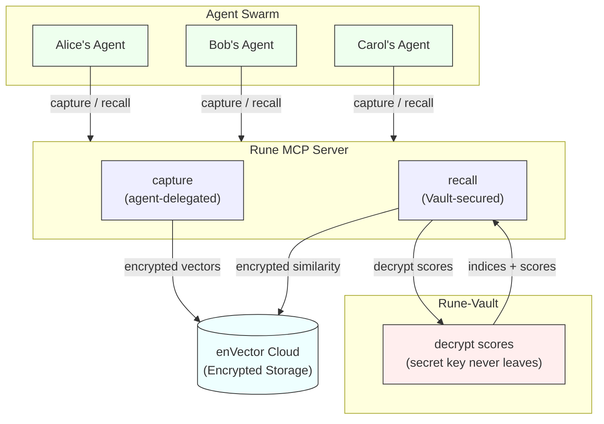

# Rune
**Your agent already knows what your team knows.**

Rune gives every AI agent on your team the **collective experience** of the entire organization — automatically, privately, and without anyone searching for it.

```
  Without Rune                         With Rune
  ━━━━━━━━━━━━                        ━━━━━━━━━

  Developer: "Should we use MongoDB?"   Developer: "Should we use MongoDB?"

  Agent: "MongoDB is great for          Agent: "Your team chose PostgreSQL
         flexible schemas..."                   over MongoDB in March. ACID
                                                compliance was non-negotiable
  (generic advice, no team context)             for transaction integrity."

  Two weeks later: "Wait, the team      The developer never searched.
  already rejected MongoDB??"           The agent just knew.
```

Works with **Claude Code, Codex CLI, Gemini CLI**, and any MCP-compatible agent.

---

## How Rune Changes Agent Behavior

### Without Rune: Isolated Agents

Every agent on your team starts from zero. They give generic advice. They can't know that another team member spent four hours debugging a connection pool issue last week, or that the architecture review in January already ruled out a microservices migration.

```
  Alice's Agent          Bob's Agent           Carol's Agent
  ┌───────────┐         ┌───────────┐         ┌───────────┐
  │           │         │           │         │           │
  │  No team  │         │  No team  │         │  No team  │
  │  context  │         │  context  │         │  context  │
  │           │         │           │         │           │
  └───────────┘         └───────────┘         └───────────┘
       ↕                     ↕                     ↕
     Alice                  Bob                  Carol

  Each agent is an amnesiac. Every conversation starts fresh.
  Knowledge dies when the session ends.
```

### With Rune: Shared Memory Across the Swarm

Every agent draws from the same pool of team experience. When Alice's agent captures a decision, Bob's agent can recall it tomorrow — without Bob ever knowing it existed.

```
  Alice's Agent          Bob's Agent           Carol's Agent
  ┌───────────┐         ┌───────────┐         ┌───────────┐
  │           │         │           │         │           │
  │  Team     │         │  Team     │         │  Team     │
  │  memory   │         │  memory   │         │  memory   │
  │  built in │         │  built in │         │  built in │
  │           │         │           │         │           │
  └─────┬─────┘         └─────┬─────┘         └─────┬─────┘
        │                     │                     │
        └──────────┬──────────┘──────────┬──────────┘
                   │                     │
            ┌──────┴──────────────┴──────────┐
            │                                │
            │    Shared Encrypted Memory     │
            │    (enVector Cloud + Vault)     │
            │                                │
            │  Every decision, every lesson, │
            │  every debugging breakthrough  │
            │  — encrypted, searchable,      │
            │  automatically surfaced.       │
            │                                │
            └────────────────────────────────┘

  The new hire's agent has the intuition of a veteran.
  Because it has the team's experience built in.
```

### What This Looks Like In Practice

**Architecture review that starts 30 minutes ahead:**
```
Lead: "Let's discuss the auth middleware rewrite"

Agent: "Before we start — your team has prior context:
       - Legal flagged the current middleware for session
         token storage (compliance issue)
       - JWT with 24h rotation was chosen over session-based
         auth in January's security review
       - Security team requires rotation under 24 hours"

Nobody asked. The context just appeared.
```

**Debugging session that saves 4 hours:**
```
Dev: "The payment service is timing out"

Agent: "A similar timeout was investigated last month — root
       cause was connection pool exhaustion under concurrent
       webhook processing. Fix was async batch processing
       with a 50-connection pool limit."

Knowledge from a teammate's past session, surfaced automatically.
```

**Onboarding that just works:**
```
New hire: "I'm thinking of using Redis for the job queue"

Agent: "Your team evaluated Redis vs SQS for the job queue
       in February. SQS was chosen because Redis required
       dedicated ops capacity the team doesn't have.
       Trade-off: higher per-message cost, but zero
       operational burden."

The new hire's agent already has institutional knowledge
they haven't been taught yet.
```

---

## This Is Not A Search Tool

Rune is **memory**, not a database.

```
  Database                            Memory
  ━━━━━━━━                           ━━━━━━

  You open a drawer.                  You're in a conversation.
  You pull out a document.            A relevant experience surfaces.
  Exact match.                        You didn't ask for it.

  "I know I don't know.               "I didn't know I knew.
   Let me search."                     It just came back to me."
```

You don't "query" Rune. Your agent draws from it unconsciously — the way an experienced engineer draws from years of past projects without thinking about it. The best sign Rune is working is when your agent gives you context you didn't ask for, and it's useful.

### How The Capture Pipeline Works (Brain Analogy)

Rune's capture system is modeled on how the brain forms long-term memories:

```
  EXPERIENCE                HIPPOCAMPUS               LONG-TERM MEMORY
  ━━━━━━━━━━               ━━━━━━━━━━━               ━━━━━━━━━━━━━━━━

  Full conversation   ──►   Agent judges:     ──►    Stores the GIST:
  with all the              "Is this significant?"
  tangents, greetings,                                "PostgreSQL for
  weather chat...           enVector checks:          financial data.
                            "Is this novel?"          ACID required.
                                                      MongoDB rejected."
                            Filters ~99% out.
                            Keeps only the insight.   Not the conversation.
                                                      The INSIGHT.
```

| Brain | Rune |
|-------|------|
| Prefrontal cortex judges significance | Agent evaluates decisions using full context |
| Hippocampus detects novelty | enVector recall checks against existing memories |
| Gist extraction (verbatim fades, meaning persists) | Agent writes a `reusable_insight` — a dense natural-language paragraph |
| Consolidation (sleep filters and stores) | Capture pipeline encrypts and stores only novel insights |
| Associative recall (cue → memory surfaces) | Semantic search on encrypted vectors |

The memory itself acts as the filter. An empty memory captures aggressively (everything is novel). A rich memory becomes selective (most things are already known). **The filter improves as the memory grows** — no patterns to maintain, no rules to update.

---

## Privacy: Zero-Knowledge Encryption

Every memory is encrypted **before leaving your machine** using Fully Homomorphic Encryption (FHE).

```
  Your Machine                           Cloud
  ━━━━━━━━━━━━                          ━━━━━

  "We chose PostgreSQL     FHE encrypt
   for ACID compliance"   ──────────►   [encrypted vector]
                                         │
  Agent asks:                            │ similarity scoring
  "database strategy?"    ──────────►   [encrypted query]
                                         │
                                         ▼
                          Vault decrypts scores only
                          (never sees the content)
                                         │
  Results returned        ◄──────────    │
  (decrypted locally)
```

- **enVector Cloud** stores and searches **only encrypted vectors** — it cannot read your data
- **Rune-Vault** holds the team's secret key and decrypts **only similarity scores** — it never sees the actual content
- **Plaintext never leaves your machine**

Even if the cloud is compromised, your organizational knowledge remains mathematically protected.

---

## Quick Start

### Install

Claude Code in terminal:
```bash
$ claude plugin marketplace add https://github.com/CryptoLabInc/rune.git
$ claude plugin install rune
```

In a Claude Code session:
```
> /plugin marketplace add https://github.com/CryptoLabInc/rune.git
> /plugin install rune
```

In a Codex CLI session:
```
> $skill-installer install https://github.com/CryptoLabInc/rune.git
```

Gemini CLI in terminal:
```bash
$ gemini extensions install https://github.com/CryptoLabInc/rune.git
```

### Configure

In slash-command agents:
```
> /rune:configure
```
In Codex CLI:
```
> $rune configure
```

You'll need credentials from your team admin:
- **Vault endpoint** + token (for decryption)
- **enVector endpoint** + API key (for encrypted storage)

Don't have these? See [rune-admin](https://github.com/CryptoLabInc/rune-admin) for deployment instructions, or [examples/team-setup-example.md](examples/team-setup-example.md) for a team onboarding walkthrough.

### That's It

Once configured, Rune works automatically. Your agent will:
- **Capture** significant decisions, trade-offs, and lessons learned during your work
- **Recall** relevant team knowledge when it matters — without being asked

No commands to memorize. No queries to write. Just work with your agent as usual.

---

## MCP Tools

For agents that want explicit control, Rune exposes these tools via MCP:

| Tool | What It Does |
|------|-------------|
| `capture` | Store a decision in encrypted team memory. Pass `extracted` JSON with the agent's evaluation and a `reusable_insight` paragraph. |
| `recall` | Search team memory semantically. Returns relevant decisions with context. |
| `vault_status` | Check Vault connection and security mode |
| `reload_pipelines` | Re-read config and reinitialize pipelines |
| `capture_history` | View recent captures from the local log |
| `delete_capture` | Soft-delete a captured record |

See [SKILL.md](SKILL.md) for the full tool reference and agent integration protocol.

---

## Architecture

```
  Agent Swarm (your team)              Cloud Infrastructure
  ━━━━━━━━━━━━━━━━━━━━━━              ━━━━━━━━━━━━━━━━━━━━

  Alice's Agent ─┐
  Bob's Agent ───┤── MCP ──► enVector Cloud (encrypted vectors)
  Carol's Agent ─┘               │
                            Rune-Vault (secret key holder)
                            decrypts similarity scores only
```


```mermaid
flowchart TD
    Cloud[("enVector Cloud<br>(Encrypted Storage)")]

    subgraph MCP [Rune MCP Server]
        Capture["capture<br>(agent-delegated)"]
        Recall["recall<br>(Vault-secured)"]
    end

    subgraph Vault [Rune-Vault]
        Decrypt["decrypt scores<br>(secret key never leaves)"]
    end

    subgraph Agents [Agent Swarm]
        A1["Alice's Agent"]
        A2["Bob's Agent"]
        A3["Carol's Agent"]
    end

    A1 & A2 & A3 -- "capture / recall" --> MCP
    Capture -- "encrypted vectors" --> Cloud
    Recall -- "encrypted similarity" --> Cloud
    Recall -- "decrypt scores" --> Decrypt
    Decrypt -- "indices + scores" --> Recall

    style Cloud fill:#eff,stroke:#333
    style Capture fill:#eef,stroke:#333
    style Recall fill:#eef,stroke:#333
    style Decrypt fill:#fee,stroke:#333
    style A1 fill:#efe,stroke:#333
    style A2 fill:#efe,stroke:#333
    style A3 fill:#efe,stroke:#333
```

**Capture flow:** Agent judges significance → generates reusable insight → novelty check against existing memory → FHE encrypt → store in enVector Cloud

**Recall flow:** Semantic query → encrypted similarity scoring → Vault decrypts scores only → retrieve and decrypt metadata locally → agent weaves context into response

---

## For Team Administrators

Rune requires two infrastructure components:

1. **Rune-Vault** — Holds the team's secret key. Decrypts only similarity scores, never content. Deploy via [rune-admin](https://github.com/CryptoLabInc/rune-admin).
2. **enVector Cloud** — Encrypted vector storage and search. Sign up at [envector.io](https://envector.io).

### Deploying

See the [Rune-Admin Repository](https://github.com/CryptoLabInc/rune-admin):
1. Deploy Rune-Vault (OCI/AWS via Terraform)
2. Create enVector Cloud account and cluster
3. Provision team index on Vault

### Onboarding Members

Give each member:
- Vault gRPC endpoint + authentication token
- enVector cluster endpoint + API key

They install the plugin, run the Rune configure command (`/rune:configure` in slash-command clients, `$rune configure` in Codex CLI), and they're connected to the team memory.

### Security Management

- **Token rotation**: New token → distribute → revoke old. Departed members lose access immediately.
- **Project isolation**: Separate Vault instances per project for isolated memory spaces.

---

## Configuration

`~/.rune/config.json`:

```json
{
  "vault": {
    "endpoint": "your-vault-host:50051",
    "token": "your-vault-token"
  },
  "envector": {
    "endpoint": "runestone-xxx.clusters.envector.io",
    "api_key": "your-api-key"
  },
  "state": "active"
}
```

| State | Behavior |
|-------|----------|
| **Active** | Full functionality — capture and recall enabled |
| **Dormant** | No network requests — shows setup instructions |

---

## Troubleshooting

```bash
# Check infrastructure health
cd rune && ./scripts/check-infrastructure.sh

# Reset configuration
rm ~/.rune/config.json

# Reinstall
claude plugin install rune
```

## Related Projects

- [Rune-Admin](https://github.com/CryptoLabInc/rune-admin) — Infrastructure deployment and admin tools
- [pyenvector](https://socket.dev/pypi/package/pyenvector) — FHE encryption SDK
- [enVector Cloud](https://envector.io) — Encrypted vector database

## Support

- **Issues**: [GitHub Issues](https://github.com/CryptoLabInc/rune/issues)
- **Docs**: [Full Rune Documentation](https://github.com/CryptoLabInc/rune-admin/tree/main/docs)
- **Email**: zotanika@cryptolab.co.kr

## License

Apache License 2.0 — See [LICENSE](LICENSE)

---

Built by [CryptoLab](https://github.com/CryptoLabInc) — where FHE meets AI agent memory.
