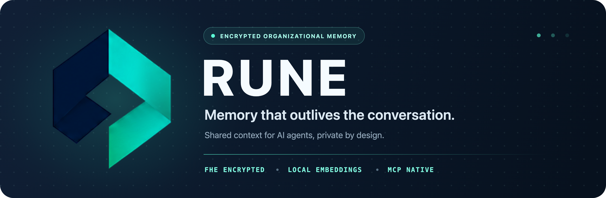
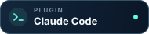
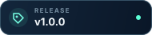
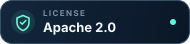
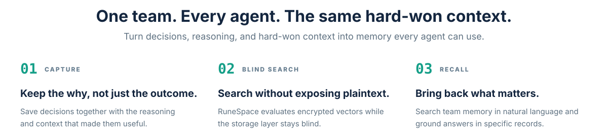
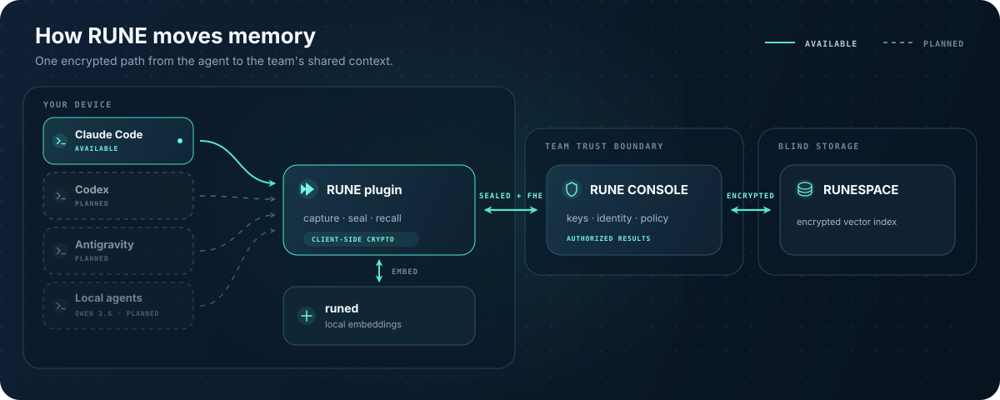

<p align="center">
  <a href="https://rune.team" aria-label="RUNE website">
    
  </a>
</p>

<p align="center">
  <a href="https://rune.team">
    
  </a><br>
  <a href="https://rune.team/docs#quickstart-member"></a>
  <a href="https://github.com/CryptoLabInc/rune/releases"></a>
</p>

<p align="center">
  <a href="#get-started-in-three-commands"></a>
  <a href="https://github.com/CryptoLabInc/rune/releases"></a>
  <a href="LICENSE"></a>
</p>

<p align="center">
  <sub><strong>AVAILABLE NOW</strong> · Claude Code &nbsp;&nbsp; <strong>COMING SOON</strong> · Codex · Antigravity · MCP-capable local agents</sub>
</p>

<br>

<p align="center">
  <picture>
    <source media="(prefers-color-scheme: dark)" srcset=".github/assets/rune-pillars-dark.svg">
    <source media="(prefers-color-scheme: light)" srcset=".github/assets/rune-pillars-light.svg">
    
  </picture>
</p>

## Get started in three commands

> [!NOTE]
> RUNE currently supports Claude Code on Linux and macOS. Codex, Antigravity, and MCP-capable local agent runtimes powered by SLMs are coming soon. You also need a `runev1_…` registration string from your RUNE workspace administrator.

Run these commands inside a Claude Code session:

```text
/plugin marketplace add https://github.com/CryptoLabInc/rune
/plugin install rune
/rune:configure
```

When prompted by `/rune:configure`, paste the registration string from your invitation email. RUNE installs its runtime, connects to your team's Console, and activates organizational memory.

Then use RUNE directly:

```text
/rune:capture We cap payment retry backoff at five minutes to prevent queue starvation during webhook spikes.
/rune:recall Why is the payment retry delay capped at five minutes?
```

See the [member quick start](https://rune.team/docs#quickstart-member) for the complete setup flow.

## Agent support

RUNE's memory layer is built on MCP, so it is not intended to stay tied to a single agent. **Claude Code is available now.** **Codex, Antigravity, and MCP-capable local agent runtimes powered by SLMs—including Qwen 3.6-based setups—are coming soon.** The same capture, blind-search, and recall workflow will carry across each integration.

## Commands

| Command | What it does |
| --- | --- |
| `/rune:configure` | Connect or reconnect this device using a registration string. |
| `/rune:capture [context]` | Save a decision, insight, or piece of team context. |
| `/rune:recall [query]` | Find relevant memories and cite their record IDs. |
| `/rune:status` | Inspect configuration, Console, keys, pipelines, and the local embedder. |
| `/rune:deactivate` | Pause capture and recall without removing credentials. |
| `/rune:activate` | Resume RUNE with the existing configuration. |
| `/rune:update` | Update the installed `rune-mcp` and `runed` runtime binaries. |

## How it works

<p align="center">
  
</p>

Claude Code is available today. Dashed integrations—Codex, Antigravity, and MCP-capable local agent runtimes, including Qwen 3.6-based setups—are planned.

1. `runed` creates the embedding on your device.
2. The plugin encrypts the vector with FHE and seals the memory payload before sending it through your team's Console.
3. RuneSpace evaluates similarity over encrypted vectors and returns encrypted results.
4. The Console, which holds the team's secret key, opens authorized results and returns the relevant memories to the agent.

RuneSpace stores neither plaintext documents nor plaintext embeddings. Team keys and access policy remain in the Console trust boundary.

## Repository map

This repository is the public entry point for RUNE's agent integrations. The current release contains the Claude Code plugin manifest, slash commands, session hook, and the bootstrap CLI that installs and supervises the shared runtime. Additional MCP-capable agent adapters will live alongside it as support expands.

| Path | Responsibility |
| --- | --- |
| [`.claude-plugin/`](.claude-plugin/) | Claude Code plugin and marketplace manifests. |
| [`commands/claude/`](commands/claude/) | User-facing RUNE slash commands. |
| [`hooks/`](hooks/) | Session integration and proactive capture hints. |
| [`cmd/rune/`](cmd/rune/) | Bootstrap, update, diagnostics, and runtime launcher CLI. |
| [`internal/`](internal/) | Verified downloads, installation checks, and process supervision. |

## Development

The bootstrap CLI is written in Go. Go 1.26.2 or newer is required for local development.

```bash
go build ./cmd/rune
go vet ./...
go test -race ./...
```

Pull requests should keep agent-specific integration thin and leave installation, updates, and supervision in the shared bootstrap layer.

## License

RUNE is licensed under the [Apache License 2.0](LICENSE).

<p align="center">
  Built by <a href="https://www.cryptolab.co.kr/">CryptoLab</a> · <a href="https://rune.team">rune.team</a>
</p>
