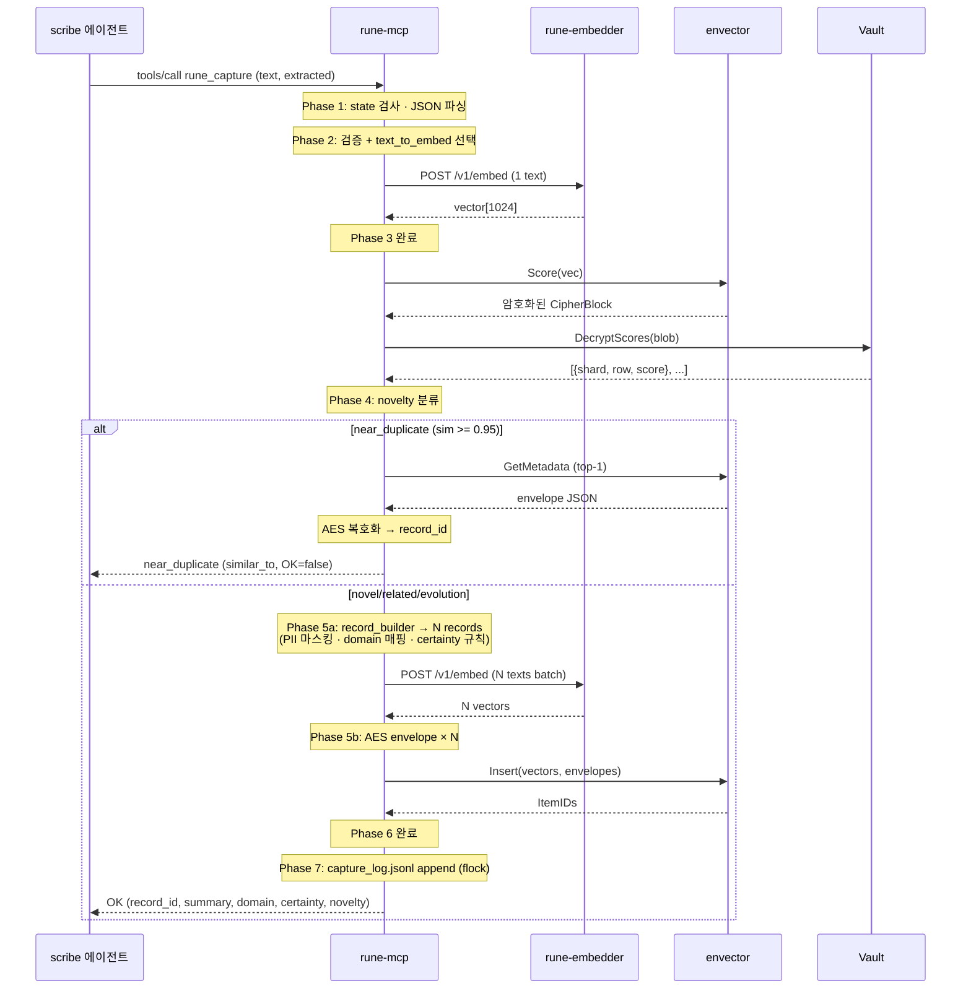

# Capture Flow — 전체 설계

rune-mcp가 scribe 에이전트의 `rune_capture` tool 호출을 처리하는 end-to-end 흐름. 7-phase로 나뉘며 각 phase에서 내려진 결정은 `decisions.md`의 D1~D20에 기록되어 있다.

이 문서는 **"전체를 한 번에 훑는 레퍼런스"**. 구현 디테일·대안 근거는 `decisions.md` 참조.

## 개요

에이전트가 의사결정 레코드를 저장하려 할 때:

1. rune-mcp가 stdio로 MCP tool call 수신
2. 입력 검증 + 임베딩 대상 텍스트 선택
3. rune-embedder에 임베딩 요청 (novelty 검사용 1회)
4. envector + Vault로 기존 레코드 대비 유사도 계산 → 분류
5. `near_duplicate` 면 거부 · 아니면 record_builder로 DecisionRecord 조립
6. (필요 시 multi-record 추가 임베딩 batch) AES envelope 생성 + envector.Insert
7. capture_log append + 응답

**핵심 원칙**:
- Python `mcp/server/server.py` + `agents/scribe/record_builder.py` 동작과 bit-identical
- agent-delegated 전제 (LLM fallback 제거, `pre_extraction` 필수)
- 모델 연산은 rune-embedder 위임 · FHE 복호화는 Vault 위임 · AES envelope은 rune-mcp 직접

## 전체 시퀀스



## Phase 1 — MCP 진입점

### 책임
- stdio JSON-RPC dispatch (공식 SDK 사용)
- state 머신 체크 (`starting`/`waiting_for_vault`/`active`/`dormant`)
- JSON 파싱 및 `CaptureRequest` 역직렬화

### 구현 형태
```go
import "github.com/modelcontextprotocol/go-sdk/mcp"

mcp.AddTool(srv, &mcp.Tool{Name: "rune_capture", Description: "..."},
    func(ctx context.Context, req *mcp.CallToolRequest, args CaptureArgs) (*mcp.CallToolResult, *CaptureResult, error) {
        if err := checkState(deps.state); err != nil { return nil, nil, err }
        return deps.captureService.Handle(ctx, args)
    })
```

### 관련 결정
- **D2**: MCP SDK = `github.com/modelcontextprotocol/go-sdk` (공식, v1.5+)

### 구현 위치
- `cmd/rune-mcp/main.go`
- `internal/mcp/tools.go` (handler)
- `internal/mcp/state.go` (state machine)

---

## Phase 2 — 검증 + text_to_embed 선택

### 책임
- `extracted` 내 알려진 필드 정규화 (phases[:7], title[:60], confidence clamp)
- Python과 동일한 silent truncate 동작
- `reusable_insight > payload.text` 우선순위로 임베딩 텍스트 선택

### 구현 형태
```go
// internal/validate/capture.go
func Capture(req *domain.CaptureRequest) error {
    if strings.TrimSpace(req.Text) == "" {
        return domain.ErrInvalidInput.With("reason", "text empty")
    }
    if req.Extracted == nil {
        return domain.ErrInvalidInput.With("reason", "extracted missing")
    }
    // phases[:7], title[:60] (UTF-8 rune), confidence clamp [0,1]
    // in-place mutation, 에러 없이 정규화
    return nil
}

// internal/policy/embedtext.go
func PickTextToEmbed(extracted map[string]any) string {
    // reusable_insight (trim, non-empty) > payload.text (trim, non-empty)
}
```

### 관련 결정
- **D3**: title 60자 rune-단위 truncate (Python 동일)
- **D4**: `extracted`는 `map[string]any` + `GetString/GetFloat/GetMap/GetList` helper
- **D5**: 빈 embed 텍스트 → `EMPTY_EMBED_TEXT` 전용 에러

### 에러
| 상황 | 코드 |
|---|---|
| `text` 빈 문자열 | `INVALID_INPUT` |
| `extracted` 필드 부재 | `INVALID_INPUT` |
| `reusable_insight` + `payload.text` 둘 다 빈 문자열 | `EMPTY_EMBED_TEXT` |

### 구현 위치
- `internal/validate/capture.go`
- `internal/policy/embedtext.go`
- `internal/domain/extracted.go` (helpers)

---

## Phase 3 — rune-embedder HTTP 호출

### 책임
- unix socket 기반 HTTP client로 `/v1/embed` 호출
- 단일 텍스트 또는 batch 지원
- retry + dim 검증 + 에러 매핑

### 구현 형태
```go
// internal/adapters/embedder/client.go
type Client struct { http *http.Client; baseURL string }

func (c *Client) Embed(ctx context.Context, texts []string) ([][]float32, error) {
    // POST /v1/embed {"texts": [...]}
    // 응답 dim 검증 · 개수 검증
}
func (c *Client) EmbedOne(ctx context.Context, text string) ([]float32, error) {
    vs, err := c.Embed(ctx, []string{text})
    if err != nil { return nil, err }
    return vs[0], nil
}

// retry: [0, 500ms, 2s] 3회
```

### 관련 결정
- **D6**: socket 경로 빌드 고정 `~/.rune/embedder.sock` (`RUNE_EMBEDDER_SOCKET` env override for test)
- **D7**: retry backoff `[0, 500ms, 2s]`
- **D8**: 부팅 시 embedder 폴링 안 함 (launchd 선기동 전제)
- **D9**: 모델 always loaded (idle eviction 미도입. configurable option은 미래 선택지)

### 에러
| 상황 | 처리 |
|---|---|
| socket 파일 없음 / connection refused | `EMBEDDER_UNAVAILABLE` (retryable) |
| 503 "starting" | `EMBEDDER_NOT_READY` (retryable) |
| timeout | `EMBEDDER_TIMEOUT` (retryable) |
| dim != 1024 | 비-retryable 에러 (모델 mismatch 방어) |

### 구현 위치
- `internal/adapters/embedder/client.go`
- `internal/policy/embedder.go` (retry backoff 상수)

---

## Phase 4 — Novelty check

### 책임
- `envector.Score(vec)` → 암호화된 유사도 blob 수신
- `Vault.DecryptScores(blob)` → 평문 top-k 점수
- `policy.ClassifyNovelty(top.score)` → `novel`/`related`/`evolution`/`near_duplicate` 분류
- `near_duplicate`면 Insert 생략하고 `similar_to` 포함한 조기 응답

### 구현 형태
```go
blobs, _ := s.envector.Score(ctx, vec)
var similarity float64
var topEntry *domain.ScoreEntry
if len(blobs) > 0 {
    entries, _ := s.vault.DecryptScores(ctx, blobs[0])
    if len(entries) > 0 {
        similarity = entries[0].Score
        topEntry = &entries[0]
    }
}
novelty := policy.ClassifyNovelty(similarity, scheme.Novelty)

if novelty.Class == policy.NoveltyNearDuplicate {
    similarTo := lookupSimilarRecord(ctx, topEntry)  // best-effort
    return nearDuplicateResponse(novelty, similarTo)
}
// Phase 5로 진행
```

### 관련 결정
- **D10**: `similar_to = record_id` (best-effort lookup, 실패 시 `shard=X,row=Y` 좌표로 degrade)
- **D11**: novelty 임계값 `{0.3, 0.7, 0.95}` (Python runtime 기본값)
- **D12**: 첫 capture (top-k 빈 경우) → `similarity=0` → `novel` 판정

### 분류 기준
| similarity | class |
|---|---|
| `< 0.3` | `novel` |
| `0.3 ~ 0.7` | `related` |
| `0.7 ~ 0.95` | `evolution` |
| `≥ 0.95` | `near_duplicate` (저장 거부) |

### 에러
| 상황 | 처리 |
|---|---|
| envector.Score 실패 | `ENVECTOR_UNAVAILABLE` (retryable) |
| Vault.DecryptScores 실패 | `VAULT_DECRYPT_FAILED` (retryable) |
| `similar_to` 조회 실패 | **Degrade** (좌표로 fallback). 판정 자체는 유효 |

### 구현 위치
- `internal/policy/novelty.go`
- `internal/service/capture.go` (호출 orchestration)

---

## Phase 5 — record_builder 포팅 + AES envelope

### 책임
- `ExtractionResult` + `RawEvent` → `[]*DecisionRecord` 변환 (Python `record_builder.py` 이식)
- 각 record: PII 마스킹 · quote 추출 · certainty/status 규칙 · domain 매핑 · group/phase 필드 · payload.text 렌더링
- N개 record면 batch로 embedding (Phase 3 API 재사용)
- 각 record metadata JSON을 AES-256-CTR envelope으로 감쌈

### 구현 형태
```go
// Phase 5a: record 조립
records, err := policy.BuildPhases(rawEvent, detection, extraction, clock)
// records: len 1~7 (phase chain / bundle)

// Phase 5b: batch embedding
embedTexts := make([]string, len(records))
for i, r := range records {
    embedTexts[i] = selectEmbedTextForRecord(r)  // reusable_insight > payload.text
}
vectors, err := s.embedder.Embed(ctx, embedTexts)  // 1회 batch 호출

// Phase 5c: AES envelope
envelopes := make([]string, len(records))
for i, r := range records {
    body, _ := json.Marshal(r)
    envelopes[i], _ = envector.Seal(agentDEK, agentID, body)
}
```

### Record builder 내부 구조
```
internal/policy/
├── record_builder.go   # BuildPhases · BuildSingle · BuildMulti
├── pii.go              # Redact (5 regex SENSITIVE_PATTERNS)
├── quote.go            # ExtractQuotes (4 QUOTE_PATTERNS)
├── rationale.go        # ExtractRationale (5 patterns)
├── evidence.go         # ExtractEvidence (quote + paraphrase fallback)
├── certainty.go        # DetermineCertainty
├── status.go           # DetermineStatus / StatusFromHint
├── domain.go           # ParseDomain · ParseSourceType (19 enum + 매핑)
├── tags.go             # ExtractTags
├── title.go            # ExtractTitle
├── record_id.go        # GenerateRecordID · GenerateGroupID (Unicode-aware slug)
├── payload_text.go     # RenderPayloadText (templates.py 이식)
└── consistency.go      # EnsureEvidenceCertaintyConsistency
```

### AES envelope 포맷 (bit-identical with pyenvector)
```json
{"a": "agent_xyz", "c": "base64(IV(16B) || CT)"}
```
- AES-256-CTR
- IV 16B `crypto/rand`
- padding 없음 (stream cipher)
- Wire: base64.StdEncoding

### 관련 결정
- **D13**: record_builder를 rune-mcp로 Option A 포팅 (B·C 미래 선택지)
- **D14**: LLM fallback 제거 · `pre_extraction` 필수 (없으면 `EXTRACTION_MISSING` 에러)
- **D15**: `render_payload_text` (Python `templates.py` 363 LoC) 전체 포팅
- **D16**: multi-record embedding은 batch 1회 (N개 개별 호출 아님)

### 검증 전략
- `scripts/gen_golden.py`가 Python `RecordBuilder.build_phases()` 실행 결과 JSON 덤프
- Go 테스트가 같은 입력으로 빌드 후 JSON bit-identical 비교
- 100+ 실 capture 샘플 커버

### 구현 위치
- `internal/policy/record_builder.go` + 관련 파일
- `internal/policy/payload_text.go`
- `internal/adapters/envector/aes_ctr.go` (Seal · Open)

---

## Phase 6 — envector.Insert

### 책임
- vectors + envelopes를 envector-go SDK의 `InsertRequest`로 전달
- Batch atomic 전제 — 실패 시 전체 재시도

### 구현 형태
```go
result, err := s.envector.Insert(ctx, envector.InsertRequest{
    Vectors:  vectors,
    Metadata: envelopes,
})
if err != nil {
    return nil, domain.ErrEnvectorInsertFailed.With("cause", err.Error())
}
if len(result.ItemIDs) != len(vectors) {
    // atomicity 가정 위배 — 이상 케이스, 로그 + 에러
    slog.ErrorContext(ctx, "atomicity violation", "expected", len(vectors), "got", len(result.ItemIDs))
    return nil, domain.ErrEnvectorInconsistent
}
```

### 관련 결정
- **D17**: atomic batch 가정. Phase 2 integration test 시점에 실측 확정. partial-failure 관찰 시 재검토
- **D18**: 응답 `record_id = records[0].id` (Python 동일, 첫 레코드만 대표)

### 에러
| 상황 | 처리 |
|---|---|
| gRPC 연결 실패 (일시) | SDK 내장 keepalive 자동 재연결 · 실패 시 `ENVECTOR_UNAVAILABLE` (retryable) |
| `len(ItemIDs) != len(Vectors)` | atomicity 위반 의심. 즉시 에러 + 구조적 로그 (D17 재검토 trigger) |
| ActivateKeys 미수행 | 부팅 시 보장하므로 정상 흐름엔 없음. 발생 시 재시도 |

### 구현 위치
- `internal/adapters/envector/client.go` (Insert 래퍼)
- `internal/service/capture.go` (호출)

---

## Phase 7 — capture_log + 최종 응답

### 책임
- `~/.rune/capture_log.jsonl` 한 줄 append (0600, flock으로 multi-process 안전)
- 응답 JSON 반환 (Python `server.py:1388-1398`와 동일 shape)

### 구현 형태
```go
// Phase 7a: capture_log append (best-effort)
entry := domain.LogEntry{
    TS:           clock.Now().UTC().Format(time.RFC3339Nano),
    Action:       "captured",
    ID:           records[0].ID,
    Title:        records[0].Title,
    Domain:       string(records[0].Domain),
    Mode:         "standard",
    NoveltyClass: string(novelty.Class),
    NoveltyScore: &novelty.Similarity,
}
if err := s.captureLog.Append(entry); err != nil {
    slog.ErrorContext(ctx, "capture_log append failed", "err", err)
    // 에러 무시 · capture 성공 유지
}

// Phase 7b: 응답
return &domain.CaptureResponse{
    OK:        true,
    Captured:  true,
    RecordID:  records[0].ID,
    Summary:   records[0].Title,
    Domain:    string(records[0].Domain),
    Certainty: string(records[0].Why.Certainty),
    Novelty:   &novelty,
}, nil
```

### 로그 포맷 (Python bit-identical)
```json
{
  "ts": "2026-04-21T10:30:00.123456+00:00",
  "action": "captured",
  "id": "dec_2026-04-21_architecture_postgres_choice",
  "title": "PostgreSQL 선택",
  "domain": "architecture",
  "mode": "standard",
  "novelty_class": "novel",
  "novelty_score": 0.23
}
```

- `ensure_ascii=False` (한글 escape 안 함) — Go `json.Marshal` 기본 동작과 일치
- `novelty_class`/`novelty_score`는 omitempty (pointer로 명시적 nil 처리)
- multi-record여도 첫 레코드만 로그 (`first.id`, `first.title`, `first.domain`)

### 관련 결정
- **D19**: append 실패 시 degrade (capture 성공 응답 유지)
- **D20**: jsonl 포맷 Python bit-identical (같은 파일 혼재 append 호환)

### 구현 위치
- `internal/adapters/logio/capture_log.go`
- `internal/domain/capture.go` (CaptureResponse)

---

## 전체 에러 경로 요약

| Phase | 상황 | 응답 코드 | Retryable |
|---|---|---|---|
| 1 | state=starting | `STARTING` | ✓ |
| 1 | state=waiting_for_vault | `VAULT_PENDING` | ✓ |
| 1 | state=dormant | `DORMANT` | ✗ |
| 1 | JSON 파싱 실패 | `INVALID_INPUT` | ✗ |
| 2 | `text` 빈 문자열 | `INVALID_INPUT` | ✗ |
| 2 | embed 텍스트 선택 실패 | `EMPTY_EMBED_TEXT` | ✗ |
| 3 | embedder 미기동 | `EMBEDDER_UNAVAILABLE` | ✓ (retry 3회) |
| 3 | embedder 모델 로드 중 | `EMBEDDER_NOT_READY` | ✓ |
| 3 | embedder timeout | `EMBEDDER_TIMEOUT` | ✓ |
| 3 | vector dim ≠ 1024 | `EMBEDDER_DIM_MISMATCH` | ✗ |
| 4 | envector.Score 실패 | `ENVECTOR_UNAVAILABLE` | ✓ |
| 4 | Vault.DecryptScores 실패 | `VAULT_DECRYPT_FAILED` | ✓ |
| 4 | near_duplicate | (ok=false, reason 반환) | — |
| 4 | similar_to 조회 실패 | **Degrade (좌표 fallback)** | — |
| 5 | `pre_extraction` 없음 | `EXTRACTION_MISSING` | ✗ |
| 5 | record_builder 내부 에러 (regex 등) | `RECORD_BUILD_FAILED` | ✗ |
| 5 | DEK 길이 ≠ 32 | `INVALID_DEK` | ✗ |
| 5 | batch embed 실패 | `EMBEDDER_*` (Phase 3와 동일) | ✓ |
| 6 | envector.Insert 실패 | `ENVECTOR_INSERT_FAILED` | ✓ |
| 6 | `len(ItemIDs) != len(Vectors)` | `ENVECTOR_INCONSISTENT` | ✗ (D17 재검토 trigger) |
| 7 | capture_log append 실패 | **Degrade (성공 응답 유지)** | — |
| 전역 | handler panic | `INTERNAL_ERROR` (MCP SDK 수준 recover) | — |

## 관련 결정 색인

| Phase | 결정 번호 |
|---|---|
| 1 (MCP 진입점) | D2 |
| 2 (검증 + text 선택) | D3, D4, D5 |
| 3 (rune-embedder 호출) | D6, D7, D8, D9 |
| 4 (Novelty check) | D10, D11, D12 |
| 5 (record_builder + AES) | D13, D14, D15, D16 |
| 6 (envector.Insert) | D17, D18 |
| 7 (capture_log + 응답) | D19, D20 |
| 전역 (미해결) | D1 (AES-MAC envelope, Deferred) |

결정 상세(배경·선택지·근거·구현·재평가 트리거)는 `docs/v04/decisions.md` 참조.

## 패키지 레이아웃 (capture flow 관여 파일)

```
cmd/rune-mcp/main.go                          # 진입점 + lifecycle 초기화

internal/mcp/
├── server.go                                  # MCP SDK 래핑
├── tools.go                                   # 8 tool handlers (capture 포함)
└── state.go                                   # state machine

internal/validate/
└── capture.go                                 # Phase 2 검증 + 정규화

internal/policy/
├── embedtext.go                               # Phase 2 text_to_embed 선택
├── novelty.go                                 # Phase 4 분류
├── embedder.go                                # retry 정책 상수
├── record_builder.go                          # Phase 5 메인
├── pii.go · quote.go · rationale.go
├── evidence.go · certainty.go · status.go
├── domain.go · tags.go · title.go
├── record_id.go · consistency.go
└── payload_text.go                            # templates 이식

internal/adapters/
├── embedder/client.go                         # Phase 3 HTTP client
├── envector/client.go                         # Phase 4·6 SDK 래퍼
├── envector/aes_ctr.go                        # Phase 5 Seal / Open
├── vault/client.go                            # Phase 4 DecryptScores
└── logio/capture_log.go                       # Phase 7

internal/service/
└── capture.go                                 # Phase 1-7 orchestration

internal/domain/
├── capture.go                                 # CaptureRequest / Response
├── decision_record.go                         # v2.1 전체 struct
├── raw_event.go · detection.go · extraction.go
└── logio.go                                   # LogEntry
```

## 테스트 전략

- **Unit (policy/)**: pure function · golden fixture Python ↔ Go 비교
- **Unit (validate, adapters)**: mock 기반
- **Concurrency (synctest)**: retry backoff · state 전환 결정적 테스트 (Go 1.25 `testing/synctest`)
- **Integration (`//go:build integration`)**: 실 rune-embedder + 실 envector + 실 Vault 왕복
- **E2E**: rune-mcp 프로세스 spawn + stdio JSON-RPC + 에이전트 시뮬레이션

## 추후 작업 (capture flow 이후)

- Recall flow (`flows/recall.md` 예정)
- Lifecycle flow (부팅 · Vault retry · shutdown)
- 에이전트 md 재검토 (scribe.md가 제공할 ExtractionResult shape 확정)
- Phase chain · group expansion (현재 DEFER)
